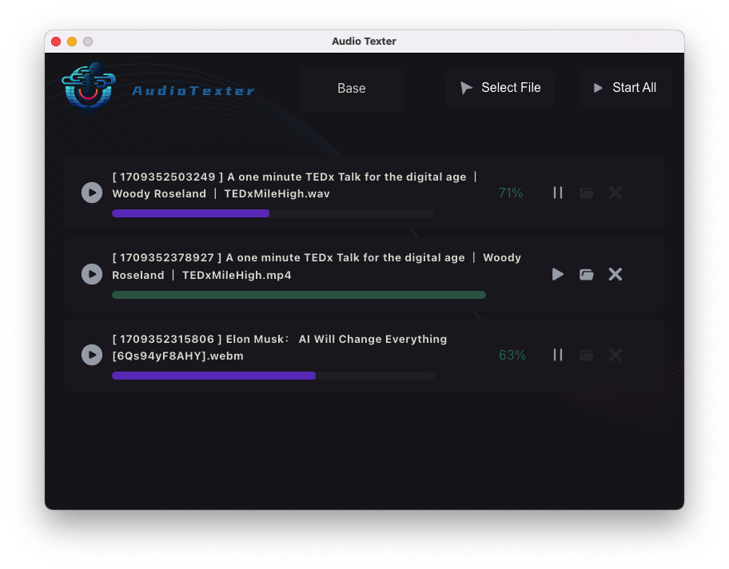

> This project is currently in active development, and you may encounter bugs or unexpected behavior while using the application. We value your input as it helps us to improve the tool for everyone.

## Media Subtitler with Whisper

This Media Subtitler application harnesses the power of [Whisper](https://openai.com/research/whisper), OpenAI's automatic speech recognition system, to generate accurate subtitles for a variety of media files. this application provides a user-friendly desktop experience for both Windows and macOS that simplifies the subtitling process.

### Features

- **Whisper Integration**: Utilizes Whisper for high accuracy in speech-to-text transcription.
- **Media Support**: Compatible with various media file formats.
- **In-App Editor**: Edit and sync subtitles within the application.
- **Customizable Model**: Adjust model settings according to your needs.
- **Cross-Platform**: Runs on Windows and macOS.

### Prerequisites

Before you begin, ensure you have these installed:
- [Node.js](https://nodejs.org/en/download/) (which comes with [npm](http://npmjs.com))
- [Electron](https://www.electronjs.org/docs/tutorial/installation)

### Installing

To install the **AudioTexter**:

1. Visit the [Releases](https://github.com/AlexWatsonCoder/AudioTexter/releases) page of our repository.
2. Download the latest version for your operating system.
3. Follow the installation instructions provided with the release to set up the application on your machine.

Please note that the application is still under development, and you might encounter bugs or unexpected behavior. We appreciate your feedback and contributions to the project.

### Issues & Contributions

This project is currently in active development, and you may encounter bugs or unexpected behavior while using the application. We value your input as it helps us to improve the tool for everyone.

If you run into any issues, have suggestions for enhancements, or want to contribute to the project, please feel free to open an issue on our GitHub repository at [Issues](https://github.com/AlexWatsonCoder/AudioTexter/issues). Additionally, if you are interested in contributing to the codebase or documentation, please refer to our contributing guidelines for more information.
